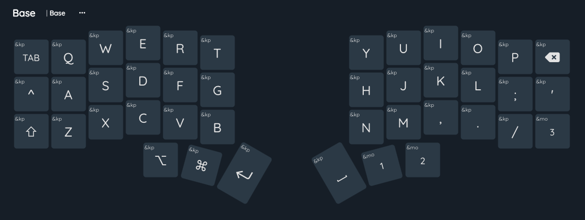
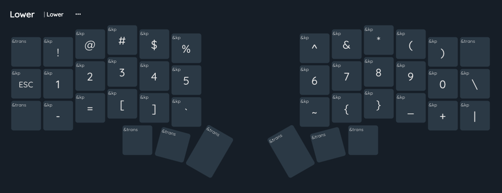
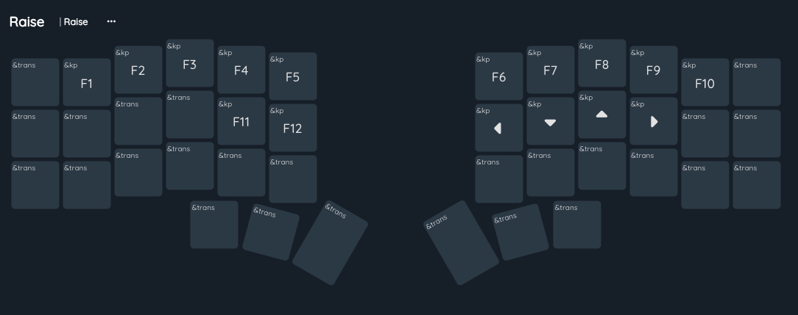
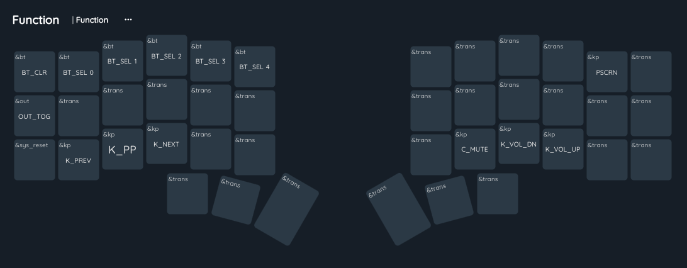

### Overview
This is my corne keyboard zmk config ^^

### Keymap

## Base Layer (Layer 0)
Base layer is for common typing.

/

## Lower Layer (Layer 1)
Lower layer is for special characters and symbols.

/ 

## Raise Layer (Layer 2)
Raise layer is for navigation and F row.

/ 

## Function Layer (Layer 3)
Function layer is for media keys. Such as Bluetooth, Volume, and Brightness.

/ 
